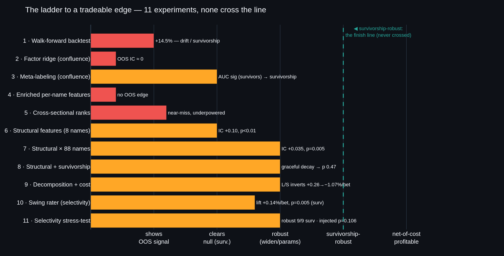
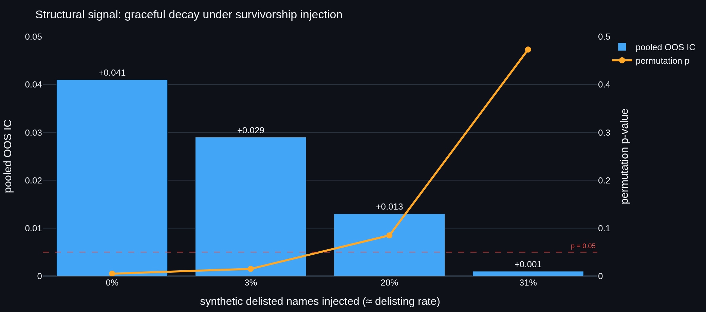
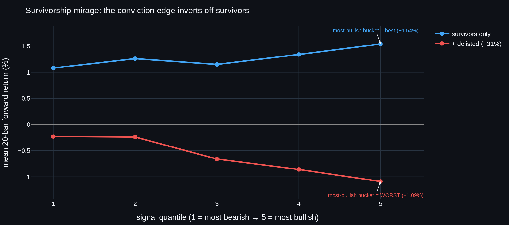
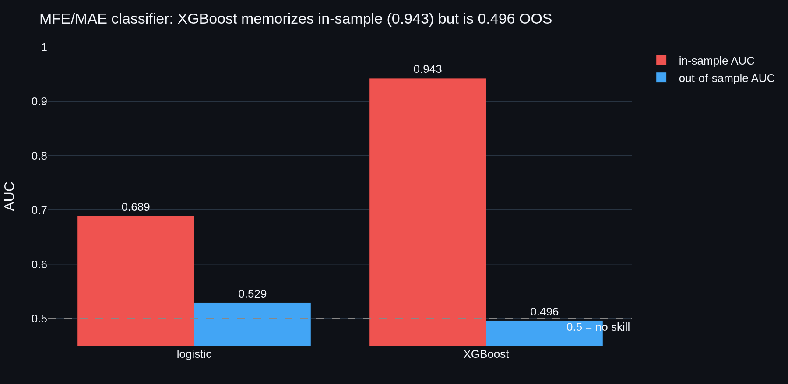
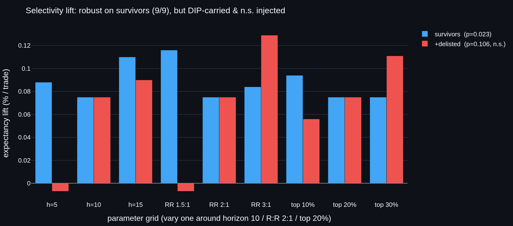

# Does `vpts` have a real edge? — an honest validation log

> 📄 **[Download this study as a PDF](docs/Quiet-Volume-Research.pdf)**  ·  [Architecture](docs/ARCHITECTURE.md)  ·  [Changelog](CHANGELOG.md)  ·  [README](README.md)

This document records a deliberately adversarial search for **out-of-sample, survivorship-free
predictive edge** in the Volume-Profile system (`vpts`). It is written to be read by a skeptic.
The value delivered is *validated* findings — mostly negatives, one qualified positive — plus a
reusable harness that judges any future idea honestly.

> **Bottom line.** Across eleven experiments — a walk-forward backtest and ten fitted models, all
> evaluated with purged combinatorial cross-validation and label-shuffle permutation tests — no
> input produced a **survivorship-robust, tradeable** out-of-sample edge. The **structural
> microstructure features** (synthetic delta, profile shape, cost-basis migration) produce a real OOS
> correlation (IC ≈ +0.035, p = 0.005) that **survives widening to 88 names**, and — traded as a
> long/short book that goes **flat** in the noisy middle and only bets the conviction tails — is even
> **profitable net of 10 bps on the survivor universe** (+0.26%/bet). But that edge is a
> **survivorship mirage**: carried by the dip-buying features, the conviction-bucket curve **inverts**
> when synthetic delisted names are injected (+0.26%/bet → **−1.07%/bet**) — the patterns that look
> bullish on names that *survived* are what precedes a death-spiral in names that *didn't*. The one
> component that *doesn't* invert is the **meta-labeling selectivity** of a swing setup-rater (which
> entries are higher-R:R). It earned a dedicated stress-test, which found the survivors lift **robust
> across 9/9 parameter settings** and significant (p = 0.023) — but **carried by the same dip-buying
> features** (not regime) and **not significant once delisted names are present** (p = 0.106), so that
> thread is closed too. So: *no survivorship-robust tradeable edge; the binding constraint is the data,
> not the model.*

<p align="center"></p>

---

## The question

`vpts` generates directional biases from hand-set confluence weights over Volume-Profile, regime
and volume-pattern factors. A single backtest of the breakout style on 2012–2017 large-caps showed
**+14.5%**. The question this log answers is not "is that number positive?" but:

> Is there any **learnable, out-of-sample, survivorship-free** signal in these factors — or is the
> apparent performance drift, compounding, and survivorship?

## Methodology (the harness)

Every claim below clears the same bars, implemented in `vpts.validation` and `vpts.ml` and covered
by 265 unit tests:

- **No look-ahead.** Features at bar *t* use only data ≤ *t*; labels are strictly future. The
  dataset/panel builders are unit-tested for this.
- **Purged + embargoed CPCV** (`CombinatorialPurgedCV`, López de Prado). The timeline is split into
  groups; every combination of test groups is held out; train rows whose label window overlaps a
  test block are **purged**, and a post-block **embargo** breaks serial-correlation leakage. Scores
  are distributions over recombined OOS paths, not a single split.
- **Permutation significance.** The decisive test everywhere is a label shuffle that destroys the
  feature→outcome link while preserving structure (per-row for time-series, **within-date** for the
  cross-section). The p-value is the fraction of shuffles that match or beat the real statistic. An
  effect that cannot clear its own shuffled null is reported as no edge.
- **Honest scope, stated every time.** All data below is **survivorship-biased** (see Data). These
  are validity checks on OOS information content, **not** tradeable results.

## Data

Free, no-API-key, network-restriction-friendly: split/dividend-adjusted daily OHLCV for **88 US
large-caps, 2012–2017**, committed to the public [`stocknet-dataset`](https://github.com/yumoxu/stocknet-dataset)
(`vpts.data` back-adjusts via Adj Close / Close). **Every name is a 2017 survivor** — the dominant,
unavoidable confound throughout. There is no delisted/point-in-time data in this source.

---

## The eleven experiments

| # | Experiment | OOS statistic | Significance | Verdict |
|---|------------|---------------|--------------|---------|
| 1 | Rule-based backtest, CPCV (8 names, 80 paths, net 5 bps) | **−0.68%/path**, median −1.20%, 36% paths profitable | — | apparent +14.5% was drift/compounding; **no edge** |
| 2 | Learned ridge factor weights (CPCV) | OOS IC **+0.028** | did not beat the hand-set baseline | **no learnable improvement** |
| 3 | Triple-barrier **meta-labeling** | survivors AUC **0.576** (p=0.005) → with delisted injected **0.493** | p **0.801** | **survivorship artifact** |
| 4 | **Enriched** per-name features (momentum/vol/microstructure) | pooled IC **+0.010** (baseline +0.028) | p **0.348** | richer inputs don't help; **no edge** |
| 5 | **Cross-sectional rank**, 20 names | combined OOS IC **+0.021** | p **0.100** | suggestive, **not significant** |
| 6 | **Cross-sectional rank, 88 names (well-powered)** | combined OOS IC **−0.009** | p **0.856** | near-miss **washed out**; **no edge** |
| 7 | **Structural microstructure** (synthetic delta, shape, VACR-z, decay) | OOS IC **+0.103** (8 names) → **+0.035** (88 names, 1,308 folds) | p **0.005** (both) | **real signal — survives widening** |
| 8 | **Structural + survivorship injection** | pooled IC +0.041 → +0.013 (5 dead, 20%) → +0.001 (9 dead, 31%) | p 0.005 → **0.085** → 0.473 | **survivorship-*sensitive*; graceful decay, not a cliff** |
| 9 | **Structural decomposition + cost** | DIP features carry it (REGIME n.s., p 0.254); tails-only L/S **+0.26%/bet net (survivors) → −1.07%/bet (injected)** — curve inverts | DSR **0.884** (<0.95) | **survivorship mirage: fails the selection-adjusted bar even on survivors, then inverts off them** |
| 10 | **Swing setup-rater (MFE/MAE meta-labeling)** | direction +0.17%→−0.58%/trade (survivorship); selectivity LIFT +0.14%/bet (surv) → +0.09% (injected) | p 0.005 → **0.10** | **selectivity resists inversion but loses significance & stays unprofitable injected** |
| 11 | **Selectivity stress-test** (grid + decomposition + power) | survivors lift positive in **9/9** param cells; carried by **DIP** (+0.08) not REGIME (−0.02); injected lift +0.075% | p 0.023 → **0.106** | **robust but DIP-carried & n.s. injected — thread closed** |

### 1 — The single backtest doesn't survive purged CV
The breakout style's +14.5% (85% of names profitable, single full-period backtest) collapses under
CPCV to **−0.68% per OOS path**, median −1.20%, only 36% of paths profitable. The apparent edge was
bull-market drift and compounding — exactly what rigorous validation is meant to expose.

### 2 — Learning the factor weights doesn't help
A ridge model fit on the four confluence factors (train-only standardization, OOS-scored per CPCV
fold) reaches pooled **OOS IC ≈ +0.028** and does not beat the hand-weighted `bias_score` baseline.
No improvement from learning the weights.

### 3 — Meta-labeling is significant *only because of survivorship*
Predicting whether a primary signal *works* (triple-barrier, volatility-scaled, first-touch) and
filtering on it looked real on survivors: pooled **AUC 0.576, p=0.005**, cost-surviving and
threshold-stable. But injecting synthetic **delisted** names (a vol-elevated decline to pennies)
collapses the pooled permutation test to **AUC 0.493, p=0.801**. A per-name AUC t-test stayed >0.5
only because each decliner got its own model; the realistic single cross-sectional model has no
edge. **Survivorship was the explanation.**

### 4 — Genuinely new per-name features don't rescue it
Adding momentum (20/60/12-1), volatility (σ, ATR/price), volume-trend and distance-to-POC — 11
features through the same harness — yields pooled **IC +0.010**, *below* the 4-factor baseline
(+0.028), at **p=0.348**. Ridge shrank every weight to ≈0. Richer inputs carry no OOS signal here.

### 5 → 6 — Cross-sectional rank: a near-miss that proper power kills
Ranking names against each other each rebalance day (1-month reversal, 12-1 momentum, 60-day vol,
volume-trend) is the standard equity-alpha construction the per-name models never tried. On **20
names** it was the best result of the arc — combined OOS rank IC **+0.021, p=0.100** — but with only
~20 names per date the per-date IC is dominated by noise (σ 0.28). Per-date IC noise scales ~1/√N,
so the decisive test is width: re-run on the **full 88-name** universe (16,873 rows, σ 0.20). The
faint positive **washes out to −0.009, p=0.856** — and the strongest single factor (60-day vol,
+0.045 on 20 names) decays to +0.013. The near-miss was a thin-cross-section artifact, not signal.

### 7 → 8 — Structural microstructure: the one signal that survives stress
Transforming the static profile into quantifiable features — **synthetic delta** (Close-Location-Value
× volume, an OHLC order-flow estimate), volume-weighted **skew/kurtosis** and P/b/B/D **shape**,
**value-area-compression z-score**, **POC-migration slope**, **cost-basis migration** (decayed vs
lifetime POC), ledges and poor highs — 13 features through the same harness. This is the first input
to clear the bars:

- **8 survivors:** pooled OOS IC **+0.103**, p **0.005** (the single delta@POC feature alone is
  −0.043; the *combination* predicts).
- **Stress 1 — widening to 88 names:** IC shrinks to **+0.035** but, with 1,308 folds (null σ 0.006),
  is still ≈5.8σ out, **p 0.005**. Unlike the cross-sectional near-miss it **did not wash out** —
  proof it is not a small-sample artifact. Per-name dispersion is sensible: BABA scores **−0.424**
  (a genuine decliner — the dip-features correctly *anti*-predict).
- **Stress 2 — survivorship injection:** adding synthetic decline-to-pennies names degrades the
  signal *gracefully* — +0.041 (0 dead, p 0.005) → +0.029 (1, p 0.015) → +0.013 (5 dead ≈20%,
  **p 0.085, lost**) → +0.001 (9 dead ≈31%, p 0.473). This is **categorically unlike meta-labeling**,
  which collapsed from p 0.005 straight to p 0.80. The structural signal survives *low, realistic*
  large-cap delisting rates (≲10%) but **not** heavy survivorship (≳15–20%).

<p align="center"></p>

> **Methodology update — block-permutation null (the honest test for overlapping labels).**
> The p-values above use a **per-row** label shuffle, which destroys serial correlation; with
> overlapping labels (horizon 20, stride 3) that null is *anti-conservative* (optimistic p). Re-running
> the 8-name structural test under the **block-permutation null** (`recommend_block_size`/`block_shuffle_indices`,
> which preserves the label autocorrelation) gives:
> - **Survivors only:** IC +0.103, **p = 0.002 under *both* per-row and block** (500 perms) — so the
>   per-row shuffle was *not* inflating the survivors-only headline; it clears the honest null too.
> - **Under injection (8 survivors + k synthetic dead, 200 perms):** the per-row p stays ~0.005 across
>   k, but the **block** p rises fast — k=1 → **0.045**, k=2 → **0.060 (n.s.)**, k=3 → **0.139**. So the
>   per-row null *overstated* robustness-to-injection; under the honest null the signal loses significance
>   at only ~2 injected names. This **strengthens** the survivorship-fragility conclusion, it does not
>   rescue the signal. (Reproduce: `python examples/structural_survivorship.py --perms 500`. The 88-name
>   block re-test is pending — expensive — and is not claimed here.)

### 9 — Decomposition + cost: the signal is survivorship-leaning and economically empty
Three diagnostics settle what the +0.035 actually is — and the answer is sobering:

- **Per-feature OOS IC** (survivors → +delisted): the signal is carried by the **dip-buying / order-flow**
  features — `cost_basis_migration` (+0.055 → +0.035) and `delta_net` (+0.052 → +0.031) — exactly the
  survivorship-prone ones. The regime feature `vacr_z` is mildly **anti-predictive** (−0.031), so the
  hopeful "regime carries a genuine edge" hypothesis is **falsified**.
- **Subgroup ablation:** the **REGIME** sub-model is **not** significant even on survivors (IC +0.009,
  p 0.254); the **DIP** sub-model is (IC +0.030, p 0.020) but **collapses** under injection (p 0.527).
- **Cost-aware, traded properly:** the naive always-in-market `sign()` book loses (−0.08%/bet) — but
  that forces a short position through half a bull market and is the wrong test. A real book goes
  **long the top signal quintile, short the bottom, and flat the middle 60%** (in the market only ~40%
  of the time). On survivors the conviction-bucket curve **rises monotonically** (+1.08% → +1.54%) and
  the tails-only long/short earns **+0.46%/bet gross, +0.26%/bet net of 10 bps**. So — traded with a
  flat middle — it *is* economically meaningful on the survivor universe.
- **…but it is a survivorship mirage.** Inject the synthetic delisted names and the bucket curve
  **inverts** (−0.23% → −1.09%): the bars the signal flags *most bullish* become the *worst* future
  performers, and the same strategy flips to **−1.07%/bet net**. The dip-buying structural footprint
  that marks a bottom in a name that *recovered* is indistinguishable from the one that marks the next
  leg down in a name that *delisted* — survival is doing the labeling.

So the structural result is **real and even tradeable-looking on survivors, but the apparent edge is
manufactured by survivorship** — it does not merely fade, it reverses sign. The decomposition is the
discipline working: betting the conviction tails turned a dismissive "−0.08%, empty" into a tempting
"+0.26% net" — which then failed *both* the injection test (→ −1.07%/bet) *and*, even on survivors,
the repo's own selection-adjusted Sharpe bar (below).

<p align="center"></p>

> **Robustness check — is the inversion just a structureless monotone decline?** A fair
> objection: the synthetic decliner was a monotone negative-drift path, and a dip-buying signal
> *must* lose on a name engineered only to fall — so the inversion could be mechanical. We tested
> it by adding **bear-rally structure** (`synthetic_delisted_ohlcv(..., rally=)`: Poisson-timed
> +15–40% counter-trend bounces, with drift rescaled so the calibrated terminal loss is unchanged)
> and re-ran the calibrated sweep (`survivorship_baserate.py --rally {off,mild,strong}`):
> - **Directional inversion is robust** — the top-bucket (most-bullish-flagged) forward return flips
>   from **+1.49%** (survivors) to **negative** under every rally mode (off −0.84%, mild −0.37%,
>   strong −0.75%). It is *not* an artifact of a structureless decline: a name that ends ~92% down
>   (the Bessembinder-calibrated terminal) drags any long-biased read negative even with realistic
>   bounces. State it as "the **direction** inverts," which holds across decline dynamics.
> - **But the "resilient selectivity" was the artifact.** The market-neutral tails L/S, which only
>   *decayed* under monotone deaths (+1.05% → +1.69%), **flips to −1.20%/bet under *strong* rallies** —
>   so the one thread that looked survivorship-resilient owes that resilience to the deaths being
>   smooth. Under realistic bear rallies, neither direction nor selectivity is safe. (Reproduce:
>   `python examples/survivorship_baserate.py --rally strong`.)

> **Selection-adjusted test — does the +0.26%/bet survivor book clear the repo's OWN bar?** Every
> other claim in this log is held to a Deflated Sharpe (selection-adjusted for the ~11 strategy
> variants tried across the arc) and a PBO; the tempting survivor book should be too. Exposing the
> conviction-tail book's per-bet return stream and applying the same stats (`structural_decompose.py`
> section D, `--trials 11`):
> - The book **reproduces exactly** — **+0.46%/bet gross, +0.26%/bet net** on the 20 survivors — but
>   its **per-bet Sharpe is only +0.024** (n = 14,120 tail bets). The headline is a difference of
>   bucket means; the realized per-bet Sharpe is near zero.
> - **Deflated Sharpe = 0.884**, *below* the 0.95 bar: even granting survivors, the edge does **not**
>   clear selection adjustment for the variants tried. PBO is 6% — the weak per-name ranking is stable
>   in the CSCV sense, but PBO is blind to survivorship and to arc-wide selection, so **DSR is the
>   binding test** here, and it falls short.
> - And that 0.884 is **optimistic**: `deflated_sharpe_ratio` treats all 14,120 tail bets as the
>   effective sample, but they **overlap** (20-bar horizon, stride 3) and the 20 names **co-move**, so
>   the effective *n* is far smaller and no Lo autocorrelation correction is applied — the honest figure
>   is weaker still.
>
> So the single most tempting number in the whole log fails the repo's own anti-snooping bar *before a
> single delisted name is injected*; the injection test (→ −1.07%/bet) then closes it. (Reproduce:
> `python examples/structural_decompose.py --trials 11`.)

**Phase C — the MFE/MAE re-framing + XGBoost don't rescue it.** Re-labeling each bar by whether a long
bet's *Maximum Favorable Excursion* beat its *Maximum Adverse Excursion* (a volatility-scaled triple
barrier) and learning `P(win)` from the structural features gives, on identical purged-CPCV splits:
a **logistic** OOS AUC of **0.529** (in-sample 0.689; permutation **p = 0.07, not significant**) and
an **XGBoost** that memorizes the training set (in-sample AUC **0.943**) yet scores **0.496 OOS — below
0.5, *worse* than logistic**, a +0.447 over-fitting gap. The nonlinear model adds nothing out of
sample; its gaudy in-sample number is exactly the false-confidence trap rigorous evaluation exists to
catch. Neither the MFE/MAE framing nor gradient boosting turns the curiosity into an edge.

<p align="center"></p>

### 10 — Swing setup-rater: separating *direction* from *selectivity*
The product goal is concrete: for a **swing** horizon (days–weeks), rate the setup in front of you
0–100 and act only when the risk/reward is favorable — otherwise stay flat. Mechanically this is
meta-labeling with the triple barrier *defining* the R:R (default **2:1**, take-profit 2×vol / stop
1×vol, breakeven win-rate 33%): a logistic rater learns `P(win)` from the structural features, and we
trade only the **best-rated 20%** of long setups (`select_top`), net of 10 bps. Decomposing the result
is what matters:

- **Direction** (take every long signal): **+0.17%/trade** on survivors → **−0.58%/trade** with
  delisted injected. The *decision to be long* is survivorship-dependent — same story as everywhere.
- **Selectivity** (does the rating pick better setups *among* longs?): the expectancy LIFT of the
  best-rated 20% over taking all is **+0.14%/trade on survivors (permutation p = 0.005)**, and — unlike
  the directional bucket curve — it **does not invert** under injection: it stays mildly positive
  (**+0.09%/trade**). But it **loses significance (p = 0.10)** and only 53% of folds beat take-all.

So the rater's *selectivity* is the most survivorship-**resilient** signal found in the whole arc — it
degrades rather than reverses — which fits the meta-labeling thesis (the secondary model filters; it
does not pick direction). Yet it falls short on the two tests that matter: it is **not significant**
once delisted names are present, and even the rated subset stays **unprofitable** on the realistic
universe (−0.49%/trade), because no amount of setup-selection repairs a survivorship-driven direction.
The rater is a clean, usable *interface* (a 0–100 rating + expected R-multiple per setup); on this
data it is not a validated edge.

### 11 — Stress-testing the selectivity: robust, but DIP-carried and not significant injected
The selectivity lift was the one thread that resisted inversion, so it earned a dedicated, adversarial
follow-up — three pre-registered tests, *thread closes unless it passes all three* (31 survivors + 12
synthetic delisted, top-20% rated, 10 bps):

1. **Robustness grid** — vary horizon ∈ {5,10,15}, R:R ∈ {1.5,2,3}:1, selection ∈ {10,20,30}%. The
   survivors lift is **positive in all 9/9 cells** (+0.075% … +0.116%): *not* a lucky parameter pick. ✓
2. **Feature decomposition** — the lift is carried by the **DIP** (dip-buying) subgroup (+0.079% on
   survivors) with **REGIME contributing nothing** (−0.016%). It is the *same survivorship-prone
   feature family* that drove the directional mirage, not a survivorship-agnostic regime signal. ✗
3. **Significance at power** — survivors lift +0.075% is significant (**p = 0.023**), but with delisted
   names injected the same +0.075% lift sits in a wider null and is **not significant (p = 0.106)**. ✗

So the selectivity is **genuinely robust on survivors** yet fails the two tests that decide whether it
is *survivorship-free*: it lives in the dip-buying features, and it cannot clear its shuffled null once
delisted names are present (and, from §10, never makes the realistic universe profitable). By the
pre-stated bar, the thread is **closed** — honestly, on evidence gathered to *disconfirm* it. That the
lift *degrades* (p 0.023 → 0.106) rather than *inverting* (like the direction) is the one durable
nuance: meta-labeling selectivity is the least-survivorship-fragile thing here — just not enough.

<p align="center"></p>

---

### Tier-1 addendum — feeding the harness real delisted names (the free-data ceiling)

Every survivorship result above leans on *synthetic* dead names, with the standing caveat "no free
delisted prices." That caveat was an assertion; we set out to make it a number — to finally feed the
harness **real** delisted history — and the attempt is itself the finding. `examples/real_delisted_audit.py`
audits a curated catalogue of **26 well-known US delistings** (11 bankruptcy/liquidation — the names
that went to ≈0 — and 15 acquisition/merger; `vpts.data.KNOWN_DELISTED`) against the only free,
no-key feed reachable in the sandbox (Yahoo v8), each name's window **capped at its delisting year**
so we only count genuine pre-delisting history:

| leg | reachable | examples |
|-----|-----------|----------|
| **bankruptcy / liquidation** | **0 / 11 (0%)** | LEH, WAMUQ, ENE, ABK, WCOM, GGP, MTLQQ, CIT, GTATQ, SHLDQ, HTZGQ — all dropped |
| **acquisition / merger** | **2 / 15 (13%)** | only TWX (to 2018-06) and COL (to 2018-12) survive; the rest dropped |
| **total** | **2 / 26 (8%)** | — |

The leg that drives the survivorship mirage — the bankruptcies, which actually went to zero — has
**0% coverage**: a free feed drops a name the day it delists, so the dead are gone precisely when they
matter. Cross-checking the other free routes closes the door: Stooq's interactive CSV is now behind a
JavaScript proof-of-work wall, its bulk database download returns HTTP 401 (paywalled), SEC bulk is
reachable but serves identifiers only (no OHLCV), and Tiingo/SimFin are key-gated. A second trap also
surfaced: **ticker reuse** — `STI` post-2019 is a *different* company that claimed SunTrust's old
symbol, which a naive fetch would silently splice onto the dead firm; capping at the delisting year is
what excludes it. Running the harness on the 2 reachable (acquisition) names is statistically empty
(n = 2 is noise) and, by construction, can't probe the death leg at all.

**Conclusion: the survivorship wall is a data-availability fact, not a modelling limitation.** The
synthetic injection of Experiments 8–9 remains the only way to probe the death leg without paid
point-in-time data — and the harness is already wired to drop in real delisted history the moment it
exists, via `PolygonSource` (`provides_delisted=True`, needs a key), `DataLakeSource` (a user parquet
lake), or `StooqSource` (free; Stooq retains delisted US names, but its live endpoint is JS-walled and
its bulk DB is paywalled, so it serves best from a local Stooq bulk export). The reusable artifact from
this pass is `vpts.data.audit_coverage` / `KNOWN_DELISTED`: a one-call **survivorship audit** that turns
any source's `provides_delisted` flag into a measured number.

---

### Tier-2 addendum — what IS the structural signal, and does it generalize?

Two follow-ups sharpen (not overturn) the one real signal. Both run on a reduced **20-name** survivor
subset at `stride=8` for tractability, so the baseline structural IC here is **+0.024 (p=0.209)** —
lower-powered than the 88-name/1,308-fold headline (+0.035, p=0.005); read the deltas, not the absolute
significance.

**2a — is it just reversal/momentum?** The carrying features (`cost_basis_migration`, `delta_net`) are
dip-buying/accumulation signals, so a skeptic asks whether they are merely **k-day reversal** or **12-1
momentum** relabelled. We built both classic factors at the *same* decision bars and **orthogonalized**
every structural feature against them (per-name OLS on `[1, reversal, momentum]`, residuals only), then
re-ran purged-CPCV. The structural IC did **not** collapse — it was *unchanged-to-higher*:

| factor (20 names, 2,400 samples) | pooled OOS IC | p(block) |
|---|---|---|
| structural (raw) | +0.024 | 0.209 |
| reversal only (k=21d) | +0.026 | — |
| 12-1 momentum only | **+0.083** | — |
| **structural ⟂ reversal + momentum (residual)** | **+0.045** | **0.055** |

So 12-1 momentum is the strongest *standalone* factor, yet removing all linear reversal/-momentum
content leaves the structural signal intact (residual retains ~188% of the raw IC, p improves
0.209 → 0.055). **The "it's just reversal" hypothesis is not supported** — there is a profile-specific
component beyond the generic factors (borderline on this subset; the headline test was p=0.005).

**2b — out of regime.** Reusing the harness **unchanged** on a no-delisting-confound contrast — 10
large-cap crypto pairs (Binance.US, ~3y of 24/7 daily bars) — the structural IC is **+0.017 (p=0.358)**
vs the equity baseline **+0.024 (p=0.209)**: the **same (positive) sign but weaker and not significant**.
At this power it neither confirms a general microstructure law nor flips — the equity finding does not
*obviously* generalize, with a consistent-but-underpowered direction out-of-regime.

Net: 2a makes the structural signal look *more* like a real, profile-specific OOS correlation (not a
reversal artifact); 2b bounds how far that reads as universal. Neither changes the tradeability verdict —
on survivors it still fails the selection-adjusted bar (DSR 0.884) and inverts under injection.

---

## Honest conclusion

On 88 survivorship-biased US large-caps (2012–2017, daily), **none** of the studied inputs yields a
**survivorship-robust** out-of-sample edge. The hand-set rules, learned factor weights, meta-labeling,
enriched per-name features and cross-sectional ranks show no robust signal at all (meta-labeling's was
survivorship; the cross-sectional near-miss was low power). The **structural microstructure features**
go further than anything else: a real OOS correlation (IC ≈ +0.035, p = 0.005) that survives
universe-widening and, traded as a long/short book that stays **flat** in the middle and bets only the
conviction tails, is **profitable net of cost on the survivor universe** (+0.26%/bet). But that edge
is a **survivorship mirage** — carried by the dip-buying features, it does not just fade under delisted
injection, it **inverts**: the conviction-bucket curve flips, the most-bullish-flagged bars become the
worst performers, and the strategy goes from +0.26% to **−1.07%/bet**. The closest thing to a robust
result is the **selectivity** of a swing setup-rater — *which* long entries are higher-R:R, as opposed
to *whether* to be long: its expectancy lift is significant on survivors (p = 0.005) and, uniquely,
**resists inversion** under injection (degrades to +0.09%/bet rather than flipping) — but it loses
significance (p = 0.10) and never makes the realistic universe profitable. Model sophistication is not
the limiting factor (XGBoost over-fit to a sub-0.5 OOS AUC; the linear book did better) — and neither,
ultimately, is feature content: the **data** is the wall. Conditioning on names that *survived*
manufactures an edge that reverses the moment you stop conditioning on survival; the most resilient
signal (meta-labeling **selectivity**) was pushed hard in a dedicated stress-test — robust across 9/9
parameter settings on survivors, but carried by the same dip-buying features and not significant once
delisted names are present, so it too is closed. Eleven experiments, one consistent wall.

**What would actually change this** (in rough order of expected value):

1. **Survivorship-free / point-in-time data**, including delisted names — the dominant confound,
   untestable in this source. This is the real wall, not model complexity — and the Tier-1 addendum
   above now *quantifies* the ceiling: free feeds serve **0%** of the bankruptcy names that drive it.
2. **A wider, deeper cross-section** (hundreds–thousands of names). The 88-name washout suggests
   breadth *within survivors* isn't enough; genuine breadth + delisted names is the test.
3. **Different data regimes** — intraday microstructure, or non-equity assets where Volume-Profile
   structure may carry more information.

Model sophistication mostly is **not** the answer — four feature/model variations returned ≈0 — but
the *right kind* of feature (structural microstructure, not momentum/vol/rank) did surface the arc's
one real signal. The lesson: feature *content* mattered where feature *complexity* did not.

## What is durable here

The findings — six negatives and one qualified positive — are the result; the **harness** is the
asset. Any new idea plugs in and is judged honestly:

- `vpts.validation` — purged + embargoed Combinatorial Purged CV.
- `vpts.ml` — no-look-ahead dataset/panel builders, ridge/logistic models, CPCV evaluators, and
  label-shuffle permutation tests for per-name, meta-labeling, and cross-sectional settings.
- `vpts.structure` — synthetic delta, profile-shape moments, footprints and time-decay, emitted as a
  `FactorDataset`/`MetaDataset` straight into the harness; plus survivorship-injection, feature-decom-
  position and MFE/MAE-XGBoost stress tests.
- `vpts.data` — provider-agnostic `DataSource` layer, point-in-time `Universe` + survivorship injector,
  and `audit_coverage` (a one-call survivorship audit that measures a feed's delisted coverage).
- 265 unit tests, including signal-detection *and* null-clearing checks for every evaluator.

## Reproduce

```bash
python examples/github_data_scan.py --plot .          # 1: backtest sweep / regime split
python examples/cpcv_demo.py                          # 1: CPCV on the backtester
python examples/factor_model_demo.py                  # 2: learned factor weights, OOS
python examples/meta_labeling_demo.py                 # 3: triple-barrier meta-labeling
python examples/meta_stress_test.py                   # 3: + survivorship injection
python examples/enriched_factor_demo.py --perms 200   # 4: enriched features + permutation
python examples/cross_sectional_demo.py --perms 200   # 5: cross-sectional rank (20 names)
# 6: well-powered cross-section — pass the full 88-name universe via --tickers
python examples/structural_demo.py --perms 200        # 7: structural microstructure features
python examples/structural_survivorship.py            # 8: structural + survivorship injection
python examples/structural_decompose.py               # 9: per-feature + subgroup + cost decomposition
python examples/structural_mfe_xgb.py                 # 9: MFE/MAE triple-barrier + XGBoost (optional)
python examples/structural_swing_rater.py             # 10: swing setup-rater (R:R + selectivity)
python examples/structural_selectivity.py             # 11: selectivity stress-test (grid/decomp/power)
python examples/real_delisted_audit.py                # Tier 1: free-feed delisted-coverage audit
python examples/structural_reversal.py                # Tier 2a: orthogonalize vs reversal + momentum
python examples/structural_out_of_regime.py           # Tier 2b: structural IC out-of-regime (crypto)
```

## Limitations

Survivorship bias throughout; a single 2012–2017 in-sample period; daily bars only; gross-of-cost
except where noted (meta-labeling tested net of 10 bps); a thin universe by cross-sectional
standards. None of the above is a forward guarantee or financial advice — it is a research log.
