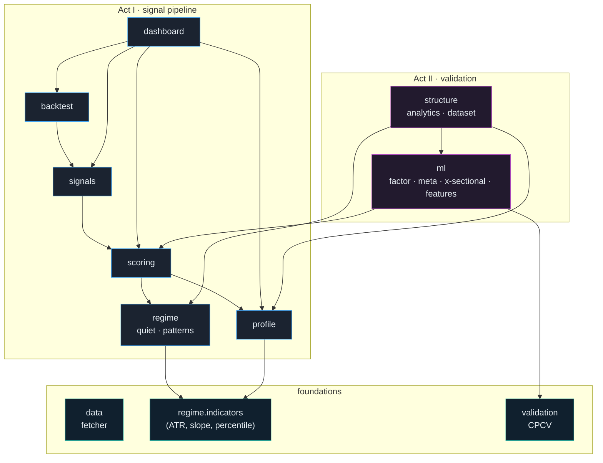
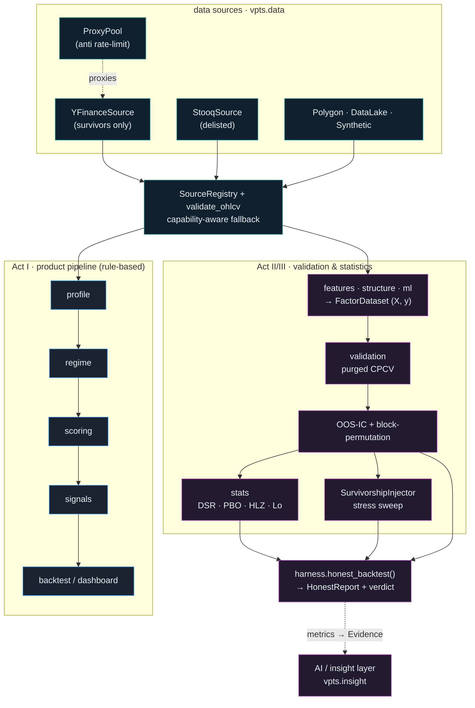
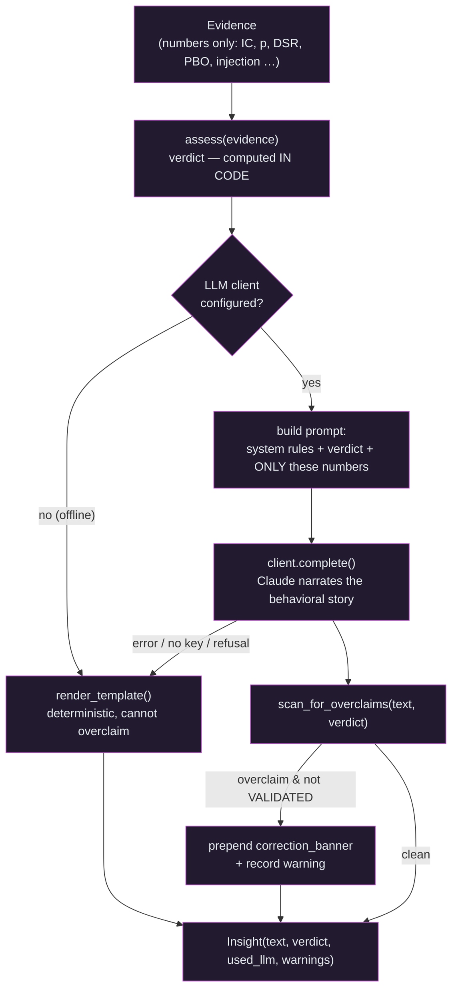

# Architecture

A module‑by‑module reference for `vpts`. For the story and findings see the [README](../README.md) and [`RESEARCH.md`](../RESEARCH.md); this document is the engineering map.

- [Design principles](#design-principles)
- [Dependency graph](#dependency-graph)
- [Runtime pipeline](#runtime-pipeline)
- [Act I — the signal pipeline](#act-i--the-signal-pipeline)
- [Act II — the validation stack](#act-ii--the-validation-stack)
- [Statistics, harness & the AI insight layer](#statistics-harness--the-ai-insight-layer)
- [Result‑object catalogue](#result-object-catalogue)
- [Extending the system](#extending-the-system)

---

## Design principles

| Principle | How it shows up |
|-----------|-----------------|
| **Dependency‑light core** | The library imports only `numpy`, `pandas`, `scipy`. Plotting/UI (`plotly`, `streamlit`) and `xgboost` are *optional extras*, imported lazily. No `pandas-ta`. |
| **Immutable results** | Every computation returns a frozen dataclass (`VolumeProfile`, `ConfluenceScore`, `TradeSignal`, `FactorCVResult`, …) with `summary()` / `as_dict()`. Inputs are never mutated. |
| **No look‑ahead, enforced** | Features at bar *t* use only data ≤ *t*; labels are strictly future. Dataset builders carry explicit unit tests asserting it. |
| **Pure functions at the edges** | Dashboard figure builders are `data → go.Figure` pure functions (unit‑tested headless); `app.py` is a thin shell. |
| **Explainability first** | Scores, signals and patterns all carry a one‑line natural‑language reason; nothing is a black box. |
| **Tested for honesty** | Each evaluator has a *signal* test (finds a planted edge) **and** a *null* test (reports nothing on noise). |

---

## Dependency graph

Internal imports only (external libs omitted). Arrows point from a module to what it depends on.

There are no import cycles: `structure` depends on `ml` (it reuses triple‑barrier labels and the `FactorDataset`/`MetaDataset` containers), never the reverse.

---

## Runtime pipeline

The graph above is *static* (imports). This is the **runtime data‑flow**: two tracks share one data layer — the rule‑based **product** (Act I) and the **validation + AI** stack (Acts II–III). Nothing is called an "edge" until it clears the harness *and* a code‑computed verdict.

- **Data layer.** One `DataSource` contract with an honest `provides_delisted` flag; `SourceRegistry` tries sources in order and `validate_ohlcv` drops structurally‑invalid bars. High‑volume free pulls can be routed through the rotating `ProxyPool` to dodge per‑IP rate limits.
- **Product track (Act I).** `profile → regime → scoring → signals` → an explainable trade plan, fed to the walk‑forward `backtest` and the Streamlit `dashboard`.
- **Validation track (Acts II–III).** `features/structure/ml` build a no‑look‑ahead `FactorDataset`; purged **CPCV** yields the OOS‑IC distribution; the **block‑permutation** test gives an honest p‑value; `stats` adds DSR/PBO; the `SurvivorshipInjector` stress‑tests against synthetic delisted names.
- **Harness.** `honest_backtest()` runs that whole checklist in one call (see below).

---

## Act I — the signal pipeline

### `vpts.data` — market data
`MarketDataFetcher.fetch(symbol, period, interval)` wraps `yfinance` with on‑disk caching, exponential‑backoff retries, and interval‑limit clamping (Yahoo serves only ~7d of 1‑minute, ~60d of intraday, etc.). Raises `NoVolumeError` for zero‑volume cash indices and `DataFetchError` on hard failures. Returns a clean OHLCV `DataFrame`.

### `vpts.profile` — Volume Profile *(Phase 1)*
`VolumeProfileCalculator(num_bins, value_area_pct, distribution, bin_mode, …).calculate(df) → VolumeProfile`.
- **POC / VAH / VAL** — point of control and the ~70% value area around it.
- **HVN / LVN** — volume peaks (support/resistance) and valleys (air pockets / targets).
- **Intra‑bar volume**: `"uniform"` spreads each bar across `[Low, High]` (conserves total volume exactly) or `"typical"` (all to `(H+L+C)/3`).
- **Auto‑binning** (`bin_mode="auto"`): bin width `≈ atr_bin_fraction × ATR`, clamped to `[min_bins, max_bins]` — finer resolution in quiet regimes. Chosen width/count recorded on `profile.extra`.

### `vpts.regime` — quiet phases & patterns *(Phase 2)*
- `indicators.py` — dependency‑free ATR, linear‑regression slope, trailing percentile rank, Bollinger bandwidth. (Replaces `pandas-ta`.)
- `QuietPhaseDetector.detect(df) → QuietPhaseResult` — blends three trailing *percentile ranks* (low ATR, drying volume, range compression) into a `quiet_score` (0–100) + `is_quiet`, with per‑bar analytics, `quiet_segments()` and a plain‑language `explanation`.
- `VolumePatternDetector.detect(df, profile=…) → VolumePatternResult` — **dry‑up, accumulation, divergence, climax**, each with a reason and (given a profile) anchored to a level.

### `vpts.scoring` — confluence *(Phase 3)*
`ConfluenceScorer().analyze(df) → ConfluenceScore` (or `.score(...)` from pre‑built parts). Four weighted, itemised components — **value‑area location, key‑level proximity, quiet regime (a non‑directional quality amplifier), active patterns** — combine into `setup_quality` (0–100) and signed `bias_score` (−100…100) with `|bias| ≤ quality`. Each `ConfluenceComponent` carries strength, direction and a reason; `summary()` renders the bar chart read‑out.

### `vpts.signals` — trade plans *(Phase 4)*
`SignalGenerator(style="reversion"|"breakout").analyze(df, account_equity) → TradeSignal`. Gates on quality/bias (± a quiet‑phase requirement) else a reasoned `NO_TRADE`. Builds entry/stop/targets **from structure** (stop beyond a level or ATR multiple; targets at POC/value edges), applies a minimum‑R:R filter, and sizes via free fixed‑fractional risk. `explain()` prints a journal‑ready write‑up.

### `vpts.backtest` — walk‑forward *(Phase 6)*
`Backtester(lookback, signal_generator, cost_model).run(df) → BacktestResult`. At each bar *t* the whole stack is computed on a rolling window ending at *t*; fills at the **open of *t+1***, all costs adverse (`CostModel`: slippage + spread + commission). One position at a time vs. its stop/targets (+ optional time stop), fixed‑fractional sizing on current equity. Returns an equity curve, full blotter, and stats (return, win rate, profit factor, max DD, expectancy, avg R, Sharpe).

### `vpts.dashboard` — Streamlit + Plotly *(Phase 5)*
`charts.py` holds pure `go.Figure` builders (price + profile overlay, quiet panel, confluence gauge, equity curve) tested headlessly; `app.py` is the interactive shell with a deep‑dive tab and a watchlist **scanner**. Entry point: `streamlit_app.py`.

---

## Act II — the validation stack

### `vpts.validation` — Combinatorial Purged CV
`CombinatorialPurgedCV(n_groups, n_test_groups, purge, embargo_pct).split(n) → list[CPCVSplit]`. The timeline is cut into `n_groups` contiguous groups; **every** combination of `n_test_groups` is held out (recombined OOS paths, not one split). Train rows whose **label window overlaps** a test block are *purged*; a trailing **embargo** removes the next `embargo_pct` of bars to kill serial‑correlation leakage. `purge` is set to the label horizon by the dataset builders.

### `vpts.ml` — the fitted models & their evaluation
| File | Provides |
|------|----------|
| `models.py` | `FactorDataset`, `MetaDataset`, `CrossSectionalPanel` (immutable, no‑look‑ahead containers) + every `…CVResult` / `…PermutationResult` / `FactorBucketResult`. |
| `factor_model.py` | `RidgeFactorModel` (numpy ridge, train‑only standardisation) · `cpcv_factor_eval` (OOS IC, dir‑acc, L/S) · `cpcv_factor_quantile_returns` (**long/short/flat conviction buckets**) · `permutation_test_factor`. |
| `meta_model.py` | `LogisticMetaModel` · `cpcv_meta_eval` (precision/AUC/return‑lift; `threshold` **or** relative `select_top`) · `permutation_test_meta`. |
| `labeling.py` | `triple_barrier_labels` (first‑touch profit/stop/vertical = MFE/MAE outcome) + `build_meta_dataset`. |
| `features.py` | `build_enriched_factor_dataset` — richer per‑name inputs beyond the four coarse confluence factors. |
| `cross_sectional.py` | `build_cross_sectional_panel` + `cross_sectional_ic_eval` — the standard equity‑alpha rank‑factor construction, scored **within‑date**. |

**Evaluation contract.** A factor evaluator reports the distribution of **out‑of‑sample IC** across CPCV paths plus a costless long/short return; a meta evaluator reports **precision / AUC / per‑trade return lift** of filtered vs. all signals. Significance is always a **label‑shuffle permutation p‑value**.

### `vpts.structure` — microstructure analytics *(the strongest signal)*
| File | Provides |
|------|----------|
| `analytics.py` | Synthetic delta (CLV×volume), profile **skew/kurtosis**, **P/b/B/D** shape classification, ledges, poor highs, value‑area‑compression z‑score, time‑decayed **cost‑basis migration**. |
| `dataset.py` | `_walk_structural` (one shared no‑look‑ahead bar walk) feeding `build_structural_dataset` → `FactorDataset` (forward return) and `build_structural_meta_dataset` → `MetaDataset` (**MFE/MAE triple‑barrier** win/loss for a fixed‑side bet). |
| `models.py` | `StructuralFeatures` row + the canonical 13‑feature ordering (`STRUCTURAL_FEATURES`). |

These 13 features feed the same harness as everything else. Their two feature families recur in the findings: **REGIME** (vacr_z, POC slope, shape, footprints) vs. **DIP** (synthetic delta, POC location, cost‑basis migration) — the decomposition (experiment 9–11) shows the signal lives in the *survivorship‑prone DIP family*.

---

## Statistics, harness & the AI insight layer

### `vpts.stats` — anti‑data‑snooping statistics
| File | Provides |
|------|----------|
| `deflated_sharpe.py` | Probabilistic & **Deflated Sharpe**, expected‑max‑Sharpe benchmark, minimum track‑record length, Lo's autocorrelation‑corrected Sharpe. |
| `pbo.py` | **Probability of Backtest Overfitting** via CSCV (combinatorially‑symmetric cross‑validation). |
| `block_permutation.py` | `recommend_block_size` + `block_shuffle_indices` — the honest null for **overlapping labels** (a per‑row shuffle over‑rejects). |
| `multiple_testing.py` | Bonferroni / Holm / BH / BY adjustment + the Harvey–Liu–Zhu haircut. |

### `vpts.data` — provider‑agnostic, survivorship‑aware
`DataSource` (+ `DataSourceCapabilities`) · `SourceRegistry` (ordered, capability‑aware fallback) · `Universe` + `SurvivorshipInjector` (point‑in‑time membership and the injection stress harness) · `audit_coverage` / `KNOWN_DELISTED` (turns the bias into a number) · sources `YFinanceSource` (survivors), `StooqSource` (delisted), `PolygonSource`, `DataLakeSource`, `SyntheticSource` · `ProxyPool` (rotating proxies, per‑proxy cooldown, never‑committed credentials).

### `vpts.harness` — the skeptic's checklist in one call
`honest_backtest(datasets, …) → HonestReport`. Bundles: pooled **OOS‑IC**, the **block‑permutation** p‑value, the conviction‑bucket curve + flat‑middle long/short net, the **Deflated Sharpe** (on an overlap‑deflated effective sample, selection‑adjusted by `n_trials`), the **PBO**, and an optional **survivorship‑injection sweep** — plus a one‑line `verdict` gated in order: significance → PBO (overfit) → survivorship inversion → DSR.

### `vpts.insight` — the generative‑AI explanation layer (narrates, never decides)
The *only* place a large language model is used, and it is deliberately sandboxed. The design separates three things (`insight/models.py`): **`Evidence`** (what the harness found — numbers only), **`Verdict`** (what may be claimed — computed in code), and **`Insight`** (the rendered explanation). The model is handed a verdict; it does not get to decide whether an edge exists.

1. **`assess(evidence)` → `Verdict`** (`guardrails.py`), deterministic and LLM‑free, in strict order: `PBO ≥ 0.5` → **OVERFIT** (dominates everything); `p ≥ 0.05` → **NO_EDGE**; inverts / loses significance under injection → **SURVIVORSHIP_FRAGILE**; significant + survives injection + `DSR ≥ 0.95` → **VALIDATED**; else **WEAK_UNVALIDATED**. Only `VALIDATED` sets `permits_edge_claim`.
2. **Prompt.** The model gets the finished verdict, its reasons, and the `Evidence` JSON with "use only these numbers". The system prompt forbids claiming a tradeable edge (unless VALIDATED) or inventing any statistic, and asks for the *behavioral‑finance* story behind the result.
3. **LLM call** (`llm.py` · `AnthropicClient`, default `claude-opus-4-8`; API key resolved from the environment, never hard‑coded). Any failure (missing package/key, refusal, empty text) becomes `InsightLLMError`.
4. **Output scan** (`scan_for_overclaims`) — a best‑effort regex backstop: on a recognised overclaim with a non‑VALIDATED verdict it prepends a `correction_banner` and records a warning (`Insight.is_clean = False`).
5. **Fallback** (`render_template`) — with no client *or* on any backend failure, a deterministic template is rendered that cannot overclaim by construction. The layer is therefore always usable and never fabricates numbers.

**Honesty guarantee, in order of strength:** (1) the code‑computed verdict is the hard gate; (2) the LLM is confined to narration; (3) scan + banner visibly neutralise an overclaim; (4) the template guarantees a safe output. The output scan is a heuristic *second* line, not the guarantee.

> The harness emits a `HonestReport`; the insight layer consumes an `Evidence`. `evidence_from_report()` / `explain_report()` (`insight/bridge.py`) bridge the two — the dashed link in the runtime diagram — so a harness run can be narrated in one step.

---

## Result‑object catalogue

Every public computation returns one of these frozen dataclasses (all with `summary()` and most with `as_dict()`):

| Object | From | Carries |
|--------|------|---------|
| `VolumeProfile` / `VolumeNode` | `profile` | POC, VAH/VAL, HVN/LVN, bins, `extra` |
| `QuietPhaseResult` / `QuietState` | `regime.quiet` | `quiet_score`, `is_quiet`, segments, explanation |
| `VolumePatternResult` / `VolumePattern` | `regime.patterns` | pattern type, strength, anchored reason |
| `ConfluenceScore` / `ConfluenceComponent` | `scoring` | `setup_quality`, `bias_score`, itemised components |
| `TradeSignal` | `signals` | action, entry/stop/targets, R:R, size, `explain()` |
| `BacktestResult` / `Trade` / `CostModel` | `backtest` | equity curve, blotter, stats |
| `CPCVSplit` | `validation` | train/test indices per recombined path |
| `FactorCVResult` / `FactorBucketResult` / `FactorPermutationResult` | `ml.factor_model` | OOS IC, weights, conviction‑bucket returns, p‑value |
| `MetaCVResult` / `MetaPermutationResult` | `ml.meta_model` | precision/AUC, return lift, `select_top`, p‑value |
| `CrossSectionalICResult` | `ml.cross_sectional` | within‑date IC distribution, p‑value |
| `StructuralFeatures` | `structure` | the 13 structural features for one bar |

---

## Extending the system

- **A new feature family?** Build a `FactorDataset` (features → forward return) or `MetaDataset` (features → triple‑barrier win) with no look‑ahead, then call `cpcv_factor_eval` / `cpcv_meta_eval` + the matching `permutation_test_*`. The bars are the same for everyone.
- **A new model?** Match the evaluation contract (OOS IC or precision/return‑lift over CPCV paths) so results are comparable; keep `fit`/`predict` numpy‑only where possible.
- **Before believing any positive**, run it through the survivorship injection (`examples/structural_survivorship.py`, `examples/structural_selectivity.py`) — that is where every promising signal in this repo has died.
