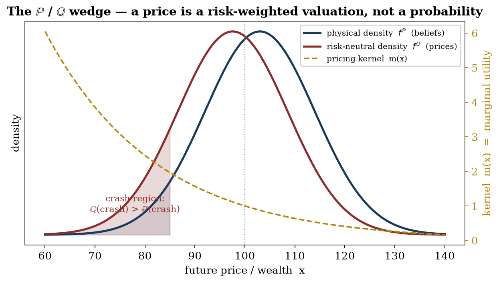
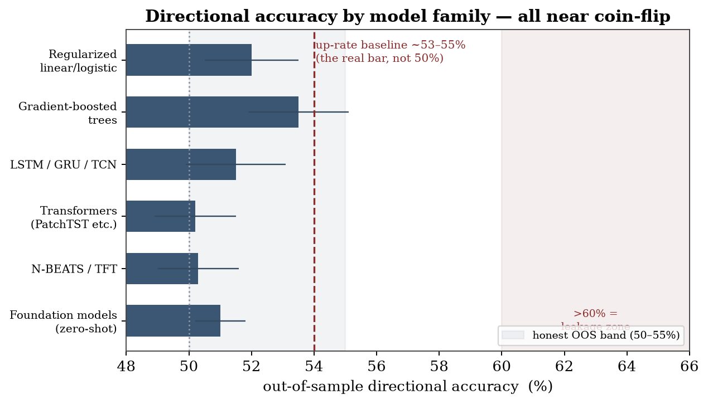
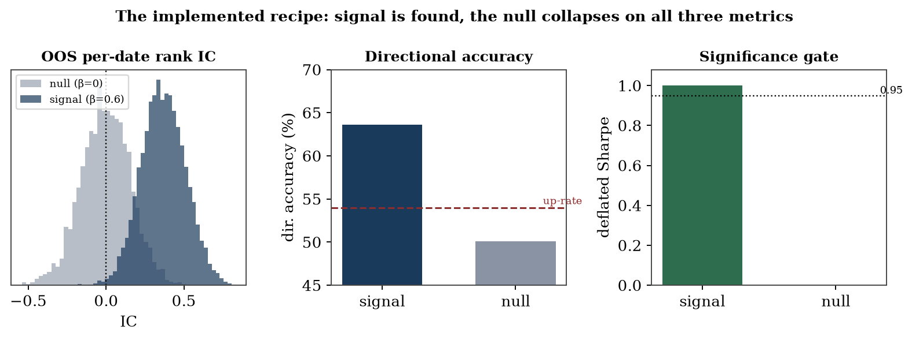
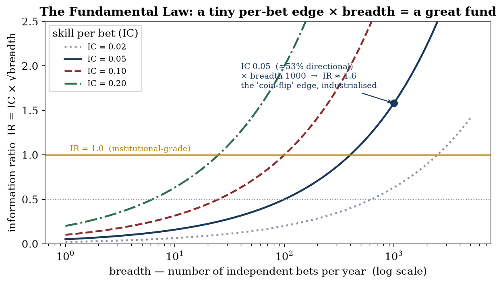

# A Plain-Language Field Guide

### The short, guided road through *Asset Pricing, Time Series, and the Limits of Prediction*

*The full compendium proves everything below in rigorous detail. This is the same path walked slowly, in plain language, one stepping-stone at a time — with the in-between reasoning made explicit and every piece of jargon explained in a box the moment it appears. If you read only one thing, read this.*

**The whole argument in five sentences.** A market price is not a forecast — it is what someone will pay to *hold a risk*, fear included. You therefore cannot read the market's true beliefs off its prices. Predicting which way a stock moves tomorrow is close to a coin toss, and most "winning" strategies are statistical illusions. And yet the market is genuinely beatable — rarely, in specific niches, by turning a microscopic edge into a real one through sheer breadth and discipline. The entire craft is telling the real sliver apart from the comfortable illusion.

---

## Step 1 — A price is a *valuation*, not a *prediction*

When you hear the market is "pricing in" a 30% chance of recession, it is not forecasting a 30% chance. It is charging for *protection* — and protection is dearer when the danger is one you'd feel badly. So a price blends *probability* with *fear*.

<aside class="metaphor" markdown="1">
**Picture it — the insurance premium.** Your fire-insurance premium is not the insurer's *forecast* that your house will burn down; it is the *price of protection*, marked up because losing your house is a disaster you will pay extra to avoid. A market price works the same way — it is a premium, not a prediction, and it quietly overcharges for exactly the outcomes everyone most wants to be protected from.
</aside>

<aside class="insert" markdown="1">
**In plain words — "risk-neutral" vs. "real-world" probability.** The number you can back out of market prices is a *risk-neutral* probability: the true odds, bent toward the outcomes people most want to insure against. It deliberately overstates bad outcomes, because a dollar received in a crash is worth more to you than a dollar received in a boom. It is a *price tag*, not a *forecast*.
</aside>

*Where this leads:* if a price is "beliefs times fear," then to recover the beliefs you would need to divide the fear back out. Can you? That is Step 2.

---

## Step 2 — You cannot divide the fear back out

The hidden "fear-weighting" inside prices has a name: the *pricing kernel*. The central theorem of the theory chapter is that you can never fully recover it from prices alone. So you can never cleanly separate what the market *believes* will happen from how much it *fears* it happening.

<aside class="metaphor" markdown="1">
**Picture it — the bill in an unknown currency.** Imagine a restaurant bill that shows only the total in dollars — but that total is the local price times an exchange rate you are never told. You cannot work out whether the meal was cheap in a strong currency or pricey in a weak one. A market price is that total: the real-world expectation times a hidden "fear exchange rate." You only ever see the product, never the two numbers that made it.
</aside>

<aside class="insert" markdown="1">
**In plain words — the pricing kernel.** Picture an invisible "exchange rate" between dollars-in-good-times and dollars-in-bad-times. Every market price equals a real-world expectation *multiplied by* this exchange rate. The mathematics shows you only ever see the **product** — never the two factors separately. That is why no formula reliably turns prices into a forecast: the forecast and the fear are baked together and cannot be unbaked.
</aside>

*Where this leads:* if prices won't hand you the market's beliefs, perhaps raw data and machine learning can predict the future directly. How well do they actually do? That is Step 3.

---

## Step 3 — Predicting direction is almost a coin toss

Measured honestly, forecasting tomorrow's up-or-down is right about **51–53%** of the time — barely better than a coin. And the bar isn't 50%: because stocks drift upward, simply guessing "up" every day already scores ~53%. You have to beat *that*.

<aside class="metaphor" markdown="1">
**Picture it — the desert weather forecaster.** In a place where it is sunny nine days in ten, a forecaster who simply says "sunny" every single day is right 90% of the time — and looks like a genius while knowing nothing at all. The market's "desert" is its long upward drift: always saying "up" already wins about 53% of the time. Real skill is beating the desert, not beating a coin.
</aside>

<aside class="insert" markdown="1">
**In plain words — "directional accuracy" and the "up-rate."** *Directional accuracy* is just how often you call the up/down direction correctly. The honest benchmark is not a 50/50 coin, because markets rise more often than they fall — the *up-rate* is ~53%. A model that scores 53% has done nothing a stopped-clock optimist couldn't. Beating the up-rate, out-of-sample, is the real test.
</aside>

*Where this leads:* 53% sounds useless — and yet published strategies routinely claim 70%, 90%, even higher. Are those real? That is Step 4.

---

## Step 4 — Most backtests lie, and we can prove why

A strategy that looks brilliant on historical data is usually fooling you. There is a discipline that separates the real from the imaginary — test only on data the model never saw, penalise how many things you tried, and charge realistic trading costs — and almost nothing survives it.

<aside class="metaphor" markdown="1">
**Picture it — the Texas sharpshooter.** He empties his rifle into the barn wall, then paints the bullseye around the tightest cluster of holes and calls himself a marksman. Testing a thousand strategies and keeping the one that looks best is painting the target *after* the shots are fired. (A strategy with look-ahead is worse still — it is a tipster handing you winning picks from *tomorrow's* newspaper: flawless on paper, useless in real time.)
</aside>

<aside class="insert" markdown="1">
**In plain words — the three ways a backtest cheats.** (1) **Look-ahead:** the model quietly uses information that wasn't available yet. (2) **Overfitting / data-snooping:** try a thousand strategies and the luckiest looks brilliant *by chance alone*. (3) **No costs:** paper profits that real trading fees would erase. The cures have names: *purged cross-validation* (test only on genuinely future, non-overlapping data) and the *deflated Sharpe ratio* (discount your result for how many attempts it took to find it).
</aside>

<aside class="insert" markdown="1">
**A true story — we caught ourselves.** The compendium's own demonstration first measured success on the *training* data. A pure-noise strategy — one with no real edge at all — "passed" with a perfect score. Fixing it to judge on data the model had never seen made the fake edge vanish instantly. The cheat is that easy to commit by accident; that is precisely why the discipline exists.
</aside>

*Where this leads:* if genuine edges are tiny and most claims are fake, is the market simply unbeatable? No — and here the whole story turns. That is Step 5.

---

## Step 5 — The turn: markets *are* beatable

A 53% edge *per bet* is not failure. Apply it to a *thousand independent bets* and it becomes a world-class track record. This is the **Fundamental Law of Active Management**:

$$\text{your overall edge} \;=\; (\text{skill per bet}) \times \sqrt{\text{number of independent bets}}.$$

<aside class="metaphor" markdown="1">
**Picture it — the casino.** On a single roulette spin the house edge is razor-thin — about the same slim margin as our "useless" 53%-vs-47% — and on any one spin the casino can easily lose. But the house never makes one bet; it makes *millions of independent small ones*, and a tiny edge times enormous breadth becomes near-certain profit. A great quantitative fund is a casino: a microscopic edge per trade, industrialised across a sea of trades. "53% is useless" is true of one spin — and a fortune across a million.
</aside>

<aside class="insert" markdown="1">
**In plain words — "breadth" and the "information ratio."** *Breadth* is how many genuinely **independent** bets you make. The *information ratio* is your return per unit of risk — the scorecard of skill. The law says that even a near-coin-flip skill, spread across enough independent bets, becomes excellent: a skill of 0.05 (about a 52–53% hit rate) times the square root of 1,000 bets gives an information ratio near 1.6 — institutional-grade. A tiny edge × huge breadth, levered and defended, *is* Renaissance's Medallion fund: roughly 39% a year, after fees, for thirty years.
</aside>

*This is the keystone of the whole book:* the gloomy "it's just a coin flip" and the hopeful "you can get rich" are **the same fact seen at two scales**. The catch — which is Step 6 — is that independent bets are scarce, edges have limited size, and they fade with time.

---

## Step 6 — Where edge lives, and why it survives

Real edges are rare, specific, and perishable. They persist only where someone is *structurally willing* to be on the other side, and where a "moat" keeps the edge from being instantly copied.

<aside class="metaphor" markdown="1">
**Picture it — the poker table.** The old rule: look around the table, and if you cannot spot the sucker, the sucker is you. To win consistently, someone must be there for reasons other than winning — the thrill-seeker, the player forced to sit down. Markets are the same: your durable profit comes from the hedger buying insurance, the index fund that must buy at any price, the investor forced to sell into a margin call. (And the sharks who would take your seat are often too busy bailing out their own boat to bother — which is *why* the easy money is not always already gone.)
</aside>

<aside class="insert" markdown="1">
**In plain words — the counterparty and the "limits to arbitrage."** For you to win, someone must be content to lose: an insurer collecting premiums, an index fund that buys regardless of price, a forced seller meeting a margin call. And the smart money that *would* copy your edge away is itself limited — it can run out of capital at exactly the wrong moment. Those two facts — a willing counterparty, and constrained competitors — are why some edges survive instead of vanishing the instant they appear.
</aside>

*The living proofs that it can be done:* **Medallion** — a microscopic edge, industrialised across millions of trades, with *negative* market exposure, so it provably cannot be mere luck or risk-taking. And **Buffett** — durable advantages found decades early and bet patiently with cheap, borrowed money. Both are *rare, specific, real, and defended* — exactly what the law predicts a winner looks like.

---

## The bottom line

Most people, most methods, most of the time, lose. A few — in specific niches, with a real and well-defended advantage — win persistently. **The market is beatable; it is just not beatable by the easy thing.** All the severity in the full compendium has one purpose: to get you into that thin, real sliver, and to stop you from spending scarce time and money on the comfortable illusion.

<aside class="metaphor" markdown="1">
**Picture it — the gold rush.** Most who rush in pan nothing but mud; a few who know the right creek, stake the claim first, and dig before the crowd arrives strike it rich. The relentless skepticism of this book is the assayer at the door — the one who tells fool's gold from the real thing, so that you do not spend your life mining mud.
</aside>

<aside class="insert" markdown="1">
**Your one-page checklist for a real edge.** (1) A nameable *reason* you should win — information, speed, structure, or a behaviour you don't share. (2) A *counterparty* structurally willing to lose. (3) *Breadth* — many genuinely independent bets. (4) Don't let *costs and constraints* strangle the signal. (5) Respect *capacity and decay* — harvest before it fades. (6) *Size* with discipline; even a real edge, over-bet, ruins you. (7) A *moat* so it can't be instantly copied. (8) And only then: prove it survives honest, out-of-sample, cost-aware testing before trusting a cent to it.
</aside>

*Want the proofs? The full compendium derives every claim above — and is honest about exactly where each one stops being true.*
